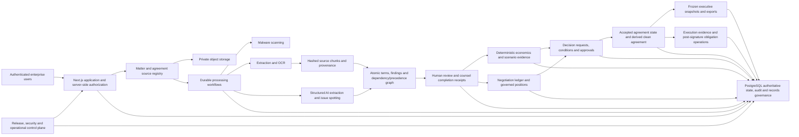

# ContractTwin production architecture

Status: target-state architecture and completion contract. This document describes the product ContractTwin is intended to become. It is not evidence that every capability is implemented or that any production environment is approved.

## 1. Product purpose

ContractTwin is a governed commercial-legal operating platform for electronics manufacturing services agreements. Its job is to preserve the authoritative source and negotiation history, translate contract language into operational and financial consequences, and place every recommendation or exception behind the correct human authority.

The product must make this chain traceable and reproducible:

`Contract language -> atomic legal effect -> operational obligation -> financial exposure -> negotiation position -> authorized decision -> operative agreement state -> execution evidence -> monitored obligation state`

It is not a general-purpose contract chatbot, an autonomous legal decision-maker, a substitute for counsel, a signature system, or an ERP/MES. Language models may extract and issue-spot; they do not create governing source text, company policy, financial facts, approval authority, or binding commitments.

## 2. Intended users and decisions

| User | Primary work | Authority boundary |
|---|---|---|
| Commercial lawyer | Build the agreement stack, validate terms/findings/relationships, draft negotiation changes, attest complete review | May state legal analysis; cannot self-approve business exceptions merely by editing analysis |
| Legal engineer | Maintain taxonomies, prompts, validation corpora, deterministic rules and legal-control evidence | May change tooling through governed release; cannot silently activate negotiation policy |
| Commercial/operations owner | Supply program facts, forecasts, inventory, capacity and operating assumptions | Owns business inputs; cannot convert assumptions into accepted contract language |
| Finance reviewer | Validate economic inputs, methods and scenarios | Validates modeled economics; does not make legal conclusions |
| Approver/executive | Decide exceptions and conditions within delegated authority | Decision is explicit, version-bound and independently recorded |
| Administrator | Manage identity, capabilities, standards and records controls | Administration does not imply counsel attestation or unrestricted self-approval |
| Executive reader | Consume a frozen, source-linked decision brief | Sees an evidence snapshot, not mutable live analysis presented as final fact |

## 3. Deployment and tenancy boundary

The current target is a single-enterprise private deployment, not a shared public multi-tenant SaaS. The authoritative source, evidence, decision and negotiation ledger must remain enterprise-controlled, exportable and operable without a permanent dependency on one application host, object store, model or OCR provider. Microsoft Entra, Vercel, PostgreSQL, Vercel Blob, OpenAI and Azure are deployment adapters in the current implementation; they are not domain boundaries. A local/private-core deployment and an enterprise-managed-cloud deployment must share the same portable ledger and policy contracts.

Customer and matter separation are business-data boundaries inside one enterprise. If a future hosted multi-tenant product is approved, organization identity, tenant-scoped keys, row-level isolation, tenant-aware storage paths, tenant-specific policy registries and cross-tenant negative testing must be designed before onboarding a second enterprise.

Confidential production use requires an approved private repository and environment. The public repository remains code and synthetic fixtures only.

## 4. Logical architecture

## 5. Bounded contexts

### 5.1 Identity and authorization

- Microsoft Entra authentication through Better Auth.
- Global application roles plus explicit matter owner/member access.
- Separately administered legal-counsel attestation capability.
- Capability-based legal review, finance review, executive approval, records administration and platform administration; role rank never implies another profession's authority.
- Server-side authorization on every resource operation; UI visibility is never the control.
- Explicit separation among requester, reviewer, approver and administrator where the action requires independence.
- Technical administration does not grant ordinary access to privileged matter content. Restricted access requires explicit membership or a time-bound, reasoned and audited break-glass event.

### 5.2 Source and agreement stack

- Original files are private, immutable source objects with client and independent server hashes.
- Malware status gates every parser and OCR path.
- Extraction generations, pages/chunks, locators and hashes preserve source provenance.
- Structure-preserving extraction retains tables, cells, tracked changes, comments, headers, footnotes, signatures and layout coordinates needed to reconstruct legal meaning.
- MSA, SOW, amendment, exhibit, pricing, quality and purchase-order documents form an explicit versioned agreement package.
- Precedence, supersession and amendment relationships require source support or counsel authorship.
- Every analysis produces a full-document/package coverage manifest, reference inventory and unresolved-definition/qualifier/schedule exceptions. A ranked chunk sample can assist retrieval but cannot establish completeness.
- Sending any source to an external processor requires a persisted authorization manifest binding exact source scope, purpose, provider/deployment/residency, allowed outputs, retention and authorizer.

### 5.3 Legal intelligence

- Contract language is decomposed into atomic obligations, rights, prohibitions, conditions, remedies, definitions and risk allocations.
- Every derived object binds to its exact source, engine policy, prompt/schema content hashes, pinned or response-reported model/deployment identity, release artifact and publication receipt.
- Unsupported or malformed model output is rejected, not repaired by inference.
- Current results can supersede earlier runs without erasing history; validation expires or is invalidated when any bound engine artifact, model identity, corpus, policy or release changes.
- Every current run, including a valid zero-output run, requires complete human disposition and a counsel completion receipt before reliance.

### 5.4 EMS risk and commercial economics

- The governed taxonomy must cover the approved 41-section EMS key-term universe and financial risk register, including the Top-10 cross-clause cascade chains, explicit financial-risk identifiers and dollar-impact methods.
- Financial facts and assumptions carry source, owner, as-of date, units, confidence and scenario status.
- Calculations are deterministic, versioned and decimal-safe where money is persisted or reconciled.
- Exposure is reported as a range or scenario distribution when the evidence does not support a point estimate.
- Direct exposure, working-capital burden, margin erosion, contingent liability and catastrophic/cascade risk remain distinguishable.
- Counsel analysis and finance validation are separate review states.
- Migration `013_decision_economics_evidence.sql` introduces the expand-safe evidence protocol. Under protocol 1, locking a governed agreement version explicitly selects one exact validated economics run that belongs to the same matter/version and uses the single active current formula. That `authoritative_economics_run_id` is immutable for the version; changing the relied-on scenario requires a new agreement version.
- The final reliance contract binds approved decisions, production execution gates and reliance-capable snapshots to the same selected authoritative run. Protocol-0 legacy rows remain readable compatibility history but are non-reliance evidence and must not authorize production execution. The expand-safe bridge remains technically available until every old bundle is drained and a separately accepted contract-enforcement migration retires it.

### 5.5 Negotiation ledger

- Every received and proposed round is immutable and ordered.
- Clause proposals preserve base text, proposed text, rationale, linked findings, linked standards, economics and required authority.
- Customer and company positions are separate; a model suggestion is never recorded as an accepted party position.
- Acceptance or rejection is an explicit authorized event. Earlier rounds are never overwritten.
- The clean operative agreement is derived only from the accepted state of a complete agreement version, with a reproducible manifest and artifact hash.
- Redline or clean-document exports are drafts until counsel explicitly authorizes the exact artifact. ContractTwin does not transmit them to a counterparty.

### 5.6 Decisions and executive evidence

- Recommendations, requests, dispositions and condition clearance are separate records.
- Approval authority is derived from a versioned policy using function, exposure/risk thresholds, delegated limits, sequence and quorum, then enforced at write time.
- An approved protocol-1 decision binds to a specific agreement version, findings, evidence state and that version's exact immutable authoritative economics run; a pending decision cannot pre-bind economics.
- Package preparation, legal approval, business/finance approval and execution confirmation are independent actions where segregation of duties requires it.
- Execution evidence includes the immutable signed artifact, signature/envelope or approved manual-verification record, parties, signature pages, executed/effective dates and confirmer.
- Execution is blocked while required evidence, reviews, decisions or conditions are incomplete.
- Executive summaries are immutable snapshots with reproducible state and terminal generator receipts.

### 5.7 Post-signature obligation operations

- The executed artifact and operative precedence state create an obligation, right, notice, renewal and termination register without rewriting the governing source.
- Each operational item binds the exact term identity, responsible function, counterparty, trigger, due/notice date, recurrence, required evidence, escalation path and current fulfillment state.
- Amendments and superseding agreements produce explicit successor relationships; they never silently mutate historical obligations or evidence.
- Alerts, calendars and ERP/MES integrations are adapters. ContractTwin may prepare a reminder or task, but it does not autonomously send a legal notice, waive a right, accept goods, authorize payment or make a customer commitment.
- Completion, exception and breach evidence remains source-linked, human-attributed and auditable; overdue or uncertain obligations are escalated rather than assumed satisfied.

### 5.8 Audit, privilege and records lifecycle

- Material actions produce append-only audit events with actor, scope, reason and relevant state transition.
- Confidentiality, privilege/work-product assessment, retention and legal hold are first-class data.
- Records policy separately governs original binaries, extracted text, source excerpts, derived objects, notes, snapshots and audit evidence.
- Source deletion is two-person, retention-aware, legal-hold-aware, disabled by default and recoverable across partial external failures.
- A purge must declare whether each derivative is retained, redacted, cryptographically erased or policy-archived. The workspace must not continue exposing verbatim source after a destruction claim. Minimum tombstone and audit evidence remain immutable.

### 5.9 Release and operations

- Schema ownership, runtime data access and one-time target bootstrap use separate database identities.
- Production release is explicit, approval-gated, exact-SHA-bound and fail-closed on live readiness.
- Database-resident target evidence proves the approved logical endpoint and current same-database routing; provider-side restores/clones require external control-plane authorization.
- Durable workers use heartbeats and monotonic fencing tokens. Only the current lease owner may publish or terminalize a job; retry generations cannot reuse a failed child implicitly. Stale-lease recovery is default-off: deploy fencing first, drain and prove termination of every pre-fencing worker, then enable recovery in a separately approved change. Rollback disables recovery and drains fenced workers before an older bundle can run.
- Structured logs, traces, metrics and alerts cover authentication, access denial, uploads, scanning, extraction/OCR, model calls, job queues, review/approval, snapshots, purge and release health.
- Recovery procedures define owners, RPO/RTO, database/object-store consistency, restore verification and reauthorization of legal reliance.

## 6. Non-negotiable invariants

1. No derived claim without an exact authorized source lineage.
2. No model output becomes governing policy, accepted language, financial fact or authorized decision.
3. No legal-reliance state without current engine evidence, governed standards and complete human review.
4. No agreement execution or clean artifact from a partial, stale or unaccepted state.
5. No overwrite of a negotiation round, reviewed legal object, terminal approval, receipt, snapshot or audit event.
6. No economics without explicit units, method version, inputs and review state.
7. No cross-matter disclosure through an opaque resource identifier.
8. No source purge under hold, before retention, by the requester alone, or without a durable recovery trail.
9. No production deployment merely because code was pushed or merged.
10. No claim of production readiness based only on source review, mocks, synthetic fixtures or a preview UI.
11. No replacement of an agreement version's selected authoritative economics; a different relied-on scenario requires a new version.
12. No production execution or reliance may be authorized from protocol-0 legacy evidence; the temporary compatibility bridge must be removed only after a proven mixed-bundle drain.

## 7. Current implementation map

| Capability | Current state |
|---|---|
| Matter intake, enterprise roles and restricted membership | Implemented vertical slice; live identity/environment acceptance still required |
| Private source upload, hashing, malware gate, extraction/OCR and chunk provenance | Implemented integration paths; source-scoped provider-processing authorization manifests, provider configuration and live failure-path evidence are still required |
| AI issue spotting, atomic terms, graph and source grounding | Implemented bounded engines and persistence controls; taxonomy/model validation remains limited and synthetic |
| Human review, counsel capability and completion receipts | Implemented in application/database controls; organizational appointment and live acceptance remain external |
| Agreement packages, statuses and execution gates | Implemented partial lifecycle; current package approval is not yet a reliance-grade legal approval, execution proof and complete segregation of duties are not implemented |
| Negotiation standards | Implemented registry/activation and finding enrichment; complete company-approved policy content is external |
| Economics | Implemented baseline deterministic scenario model plus an expand-safe protocol-1 immutable agreement-version authoritative-economics path; protocol-0 compatibility remains until the mixed-bundle drain/contract phase, and full EMS risk-register methods, assumption ledger, ranges and portfolio roll-up are not implemented |
| Decisions, conditions and executive snapshots | Implemented version-bound vertical slice and protocol-1 decision/economics binding controls; snapshot-wide contract enforcement and protocol-0 retirement remain an explicit source blocker, while delegated authority policy and live executive acceptance remain external |
| Audit, legal hold, retention and two-phase binary purge | Implemented controls; derivative-content destruction semantics, corporate policy values, object-store recovery and operational drills remain incomplete |
| Release/database hardening | Implemented code and disposable PostgreSQL evidence; provider restore-incarnation evidence and production credentials are external |
| Observability, SLOs, incident tooling and load/capacity evidence | Not production-complete |
| Negotiation ledger, redline artifact pipeline and accepted-state clean agreement | Not implemented |
| Post-signature obligation, notice, renewal and fulfillment operations | Not implemented |
| End-to-end browser/API accessibility and multi-user concurrency suite | Not production-complete |

## 8. Definition of a production-grade platform

ContractTwin is production-grade only when all of the following are true for the exact deployed release and environment:

- the core workflows above are implemented without placeholder or demo data crossing into reliance state;
- the complete approved EMS taxonomy, standards, risk methods and authority matrix are loaded with provenance;
- source, analysis, review, economics, negotiation, decision and accepted agreement state are reproducible end to end;
- independent security/privacy/privilege/records reviews and threat-based penetration testing are complete;
- authenticated browser/API acceptance, accessibility, concurrency, retry, load and failure-recovery tests pass;
- monitoring, alerts, on-call ownership, SLOs, backup/restore and object/database reconciliation are operational;
- the system runs from an approved private repository and approved data-processing environment;
- named legal, finance, product, security, records and technical owners approve reliance; and
- remaining limitations are explicit in the user interface and release evidence.

## 9. Prioritized delivery sequence

1. Complete live acceptance of the implemented release-target/bootstrap safety and preserve exact reproducible evidence.
2. Close the remaining reliance-kernel gaps: full-package coverage, structure-preserving extraction, processing authorization and content-hashed engine identity; drain all pre-protocol-1 bundles and complete the decision/economics/snapshot contract-enforcement phase; retain fenced-worker and retry acceptance as a release gate.
3. Separate professional capabilities and implement the versioned, multi-step approval and execution-evidence model.
4. Add the immutable negotiation ledger and accepted-state artifact model before calling the product a complete contract lifecycle platform.
5. Expand the EMS taxonomy/risk/economics model into versioned governed data with an assumption and evidence ledger.
6. Refactor API/UI boundaries into typed domain services, shared validation and stable contracts; add route-level and browser workflow tests.
7. Add structured observability, SLOs, queue/retry operations, reconciliation and recovery automation.
8. Complete production integrations and live security, accessibility, concurrency, load and disaster-recovery acceptance.

Every tranche must preserve source lineage, immutable history, explicit human authority and honest readiness reporting.
